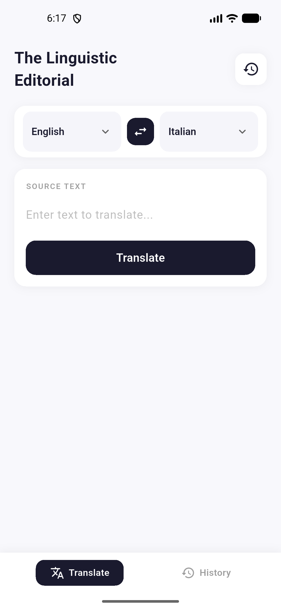
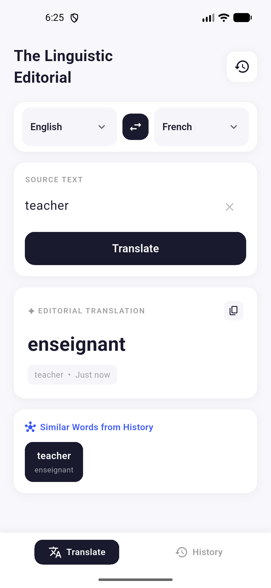
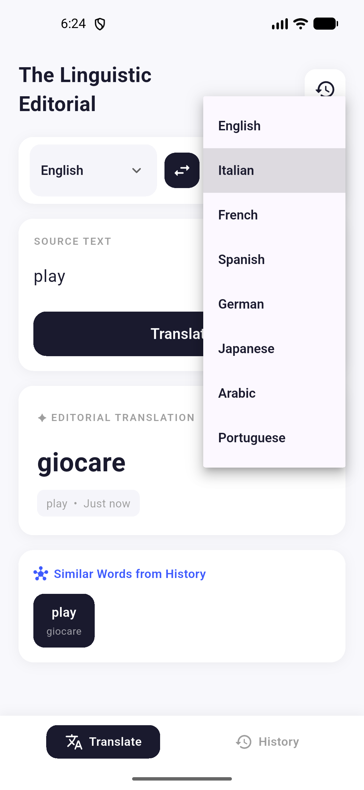
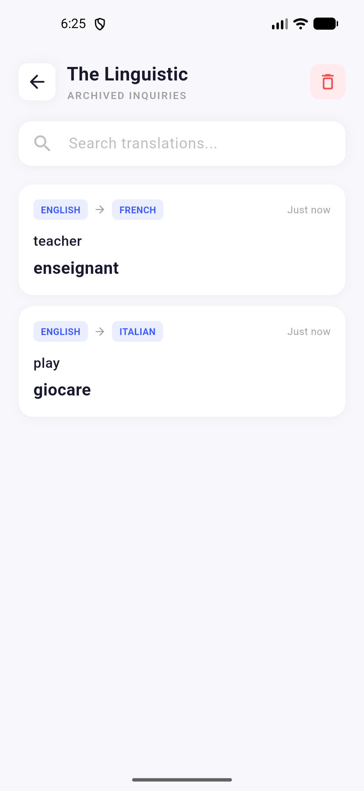
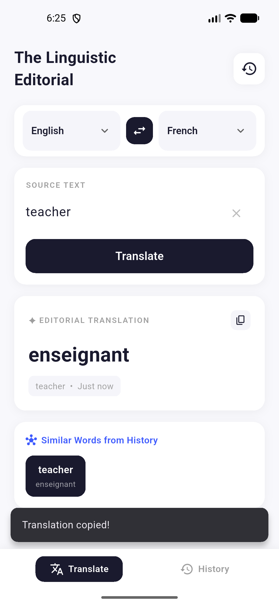

# 🌐 The Linguistic Editorial

<div align="center">


**A smart AI-powered translation app built with Flutter, featuring translation history, similar word suggestions, and a clean editorial UI.**

</div>

---

## 📱 Screenshots

<div align="center">

| Home Screen | After Translation | Language Picker |
|:-----------:|:-----------------:|:---------------:|
|  |  |  |

| History Screen | Copy Confirmation |
|:--------------:|:-----------------:|
|  |  |

</div>

---

## ✨ Features

- 🔤 **AI-Powered Translation** — Translate text across multiple languages using the Claude AI API
- 🌍 **Multiple Languages** — English, Italian, French, Spanish, German, Japanese, Arabic, Portuguese
- 🔁 **Language Swap** — Instantly swap source and target languages with one tap
- 📋 **Copy Translation** — Copy any result to clipboard with a single tap
- 🕓 **Translation History** — Browse all past translations with timestamps
- 🔍 **Search History** — Search through archived translations instantly
- 🧠 **Similar Words from History** — Smart suggestions based on your translation history
- 🗑️ **Clear History** — Delete all archived translations at once
- 📡 **Network Awareness** — Detects internet connectivity status

---

## 🏗️ Architecture

This project follows **Clean Architecture** principles with a **feature-based folder structure**.

```
lib/
├── core/
│   ├── di/                  # Dependency Injection (GetIt)
│   ├── error/               # Failures & Exceptions
│   ├── network/             # Network checker
│   └── utils/               # Constants & helpers
│
└── features/
    └── translation/
        ├── data/
        │   ├── datasources/     # Remote & Local data sources
        │   ├── models/          # Data models (Hive)
        │   └── repositories/    # Repository implementations
        │
        ├── domain/
        │   ├── entities/        # Business entities
        │   ├── repositories/    # Abstract repository contracts
        │   └── usecases/        # Application use cases
        │
        └── presentation/
            ├── bloc/            # BLoC state management
            ├── pages/           # Screens
            └── widgets/         # Reusable UI components
```

---

## 🛠️ Tech Stack

| Category | Technology |
|----------|-----------|
| Framework | Flutter |
| Language | Dart |
| State Management | flutter_bloc |
| Dependency Injection | get_it |
| Local Storage | hive + hive_flutter |
| HTTP Client | dio |
| Functional Programming | dartz |
| Network Detection | internet_connection_checker_plus |
| Localization | intl |
| Code Generation | build_runner + hive_generator |

---

## 🚀 Getting Started

### Prerequisites

- Flutter SDK `^3.10.4`
- Dart SDK `^3.x`

### Installation

1. **Clone the repository**

```bash
git clone https://github.com/ahmed24E/translation-app.git
cd translation-app
```

2. **Install dependencies**

```bash
flutter pub get
```

3. **Run code generation** (for Hive adapters)

```bash
dart run build_runner build --delete-conflicting-outputs
```

4. **Run the app**

```bash
flutter run
```

---

## 📦 Dependencies

```yaml
dependencies:
  flutter_bloc: ^9.1.1     # State management
  get_it: ^9.2.1           # Dependency injection
  dio: ^5.9.2              # HTTP client
  hive: ^2.2.3             # Local storage
  hive_flutter: ^1.1.0     # Hive Flutter integration
  dartz: ^0.10.1           # Functional programming (Either)
  equatable: ^2.0.8        # Value equality
  intl: ^0.20.2            # Internationalization
  internet_connection_checker_plus: ^3.0.1  # Network check

dev_dependencies:
  build_runner: ^2.4.7
  hive_generator: ^2.0.1
  flutter_lints: ^6.0.0
```

---

## 🗂️ Screens Overview

| Screen | Description |
|--------|-------------|
| **Translate** | Main screen — input text, select languages, and get AI translation |
| **History** | View all past translations with source → target language tags |

---

## 🤝 Contributing

Contributions are welcome! Feel free to open an issue or submit a pull request.

1. Fork the project
2. Create your feature branch (`git checkout -b feature/amazing-feature`)
3. Commit your changes (`git commit -m 'Add amazing feature'`)
4. Push to the branch (`git push origin feature/amazing-feature`)
5. Open a Pull Request

---

## 👨‍💻 Author

**Ahmed** — Flutter Developer

[](https://github.com/ahmed24E)

---

## 📄 License

This project is for educational and portfolio purposes.